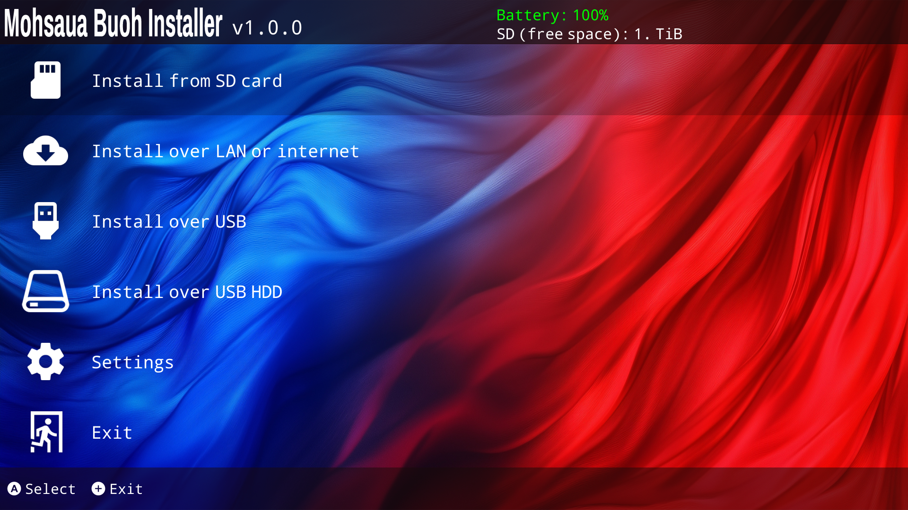

# MBI
`MBI` or `Mohsaua-Buoh-Installer` is a No-Bullshit NSP, NSZ, XCI, and XCZ Installer for personal game dumps.  
`Mohsaua Buoh`, the YngPing romanization of `莫価話 卜`, comes from Eastern Min patois and means `No bullshit, will do something`.  
`MBI` therefore stands for `No bullshit just install` in English.
And in Chinese, it is also known as `别多话, 就安装`

## Features
- Installs NSP/NSZ/XCI/XCZ files from your SD card
- Installs NSP/NSZ/XCI/XCZ files from your USB Disk (Support FAT32, exFAT, NTFS and EXT2/3/4)
- Installs NSP/NSZ/XCI/XCZ files and split NSP/XCI files over LAN or USB from tools such as [NS-USBloader](https://github.com/developersu/ns-usbloader)
- Installs NSP/NSZ/XCI/XCZ files over HTTP Directory Indexing like nginx or Apache
- Verifies NCAs by header signature before they're installed
- Verifies NCA hashes during installation
- Supports USB hard drives with multiple partitions and/or multiple USB storage devices

## Coloring support
To use this, you must place the "color.json" at "sdmc:/config/MBI" dir. See [example](doc/color.json) for more details.  
Use your wanted HEX RGBA colors -> https://rgbcolorpicker.com

## Thanks to
- dezem and other contributors for original [AtmoXL-Titel-Installer](https://github.com/dezem/AtmoXL-Titel-Installer)
- Huntereb for [Awoo-Installer](https://github.com/Huntereb/Awoo-Installer)
- Adubbz and other contributors for original [Tinfoil](https://github.com/matt-teix/Tinfoil)
- XorTroll for [Plutonium](https://github.com/XorTroll/Plutonium) and [Goldleaf](https://github.com/XorTroll/Goldleaf) and [libnx-ext](https://github.com/XorTroll/libnx-ext)
- nicoboss for [NSZ/XCZ](https://github.com/nicoboss/nsz) support
- DarkMatterCore, XorTroll and Rhys Koedijk for [libusbhsfs](https://github.com/DarkMatterCore/libusbhsfs)
